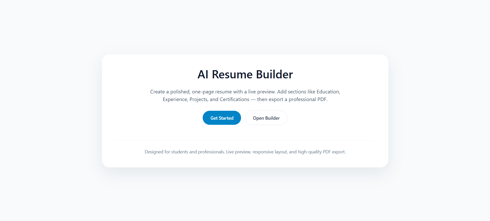
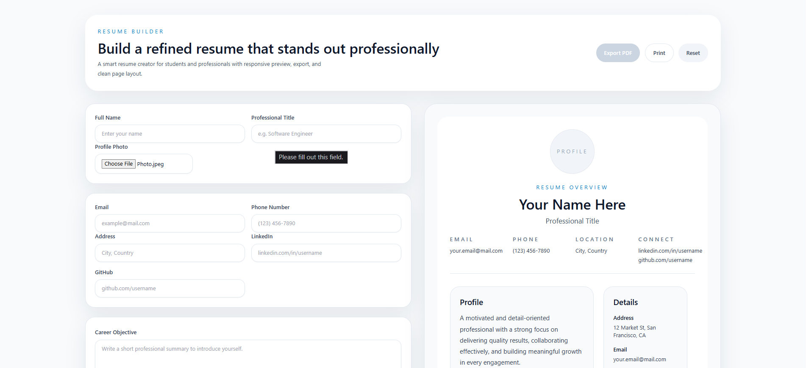
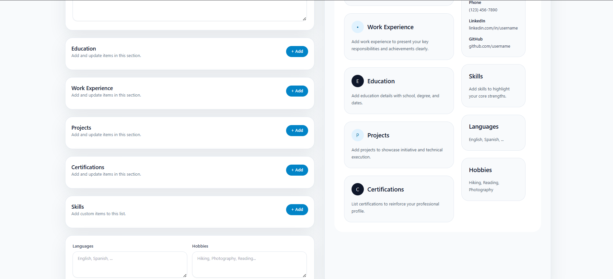
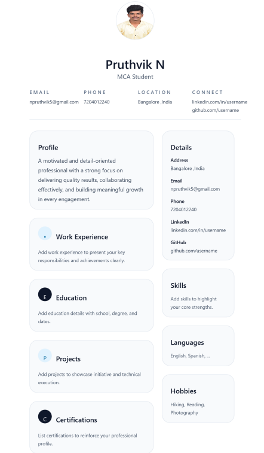

 # AI Resume Builder

 A modern, responsive Resume Builder web application that helps users create professional resumes with a live preview and download them as PDF.

 ---

 ## Features

 - Professional and responsive UI
 - Live Resume Preview
 - Profile Photo Upload
 - Personal Information Form
 - Multiple Education Entries
 - Multiple Work Experience Entries
 - Skills Section
 - Projects Section
 - Certifications Section
 - Languages & Hobbies
 - Download Resume as PDF
 - Print Resume
 - Mobile-Friendly Design

 ---

 ## Tech Stack

 - React
 - TypeScript
 - Vite
 - Tailwind CSS
 - HTML5
 - CSS3
 - JavaScript

 ---

 ## Project Structure

 ```
 AI-Resume-Builder/
 │
 ├── src/
 │   ├── App.tsx
 │   ├── Home.tsx
 │   ├── main.tsx
 │   └── index.css
 │
 ├── public/
 ├── package.json
 ├── vite.config.ts
 ├── tailwind.config.js
 └── README.md
 ```

 ---

 ## Installation

 ### Clone the repository

 ```bash
 git clone https://github.com/npruthvik5-sys/AI-Resume-Builder.git
 ```

 ### Navigate to the project

 ```bash
 cd AI-Resume-Builder
 ```

 ### Install dependencies

 ```bash
 npm install
 ```

 ### Run the development server

 ```bash
 npm run dev
 ```

 Open your browser and visit:

 ```
 http://localhost:5173
 ```

 ---


## 📸 Screenshots

### 🏠 Home Page



### 📝 Resume Builder Form & Live Preview (1)



### 📝 Resume Builder Form & Live Preview (2)



### 📄 Downloaded Resume (PDF)



 ---

 ## Future Enhancements

 - AI Resume Summary Generator
 - ATS Resume Checker
 - Resume Templates
 - Cover Letter Generator
 - Job Description Matching
 - Cloud Storage
 - User Authentication

 ---

 ## Author

 **Pruthvik N**

 GitHub: https://github.com/npruthvik5-sys

 ---

 ## License

 This project is developed for educational purposes.  this is readme
